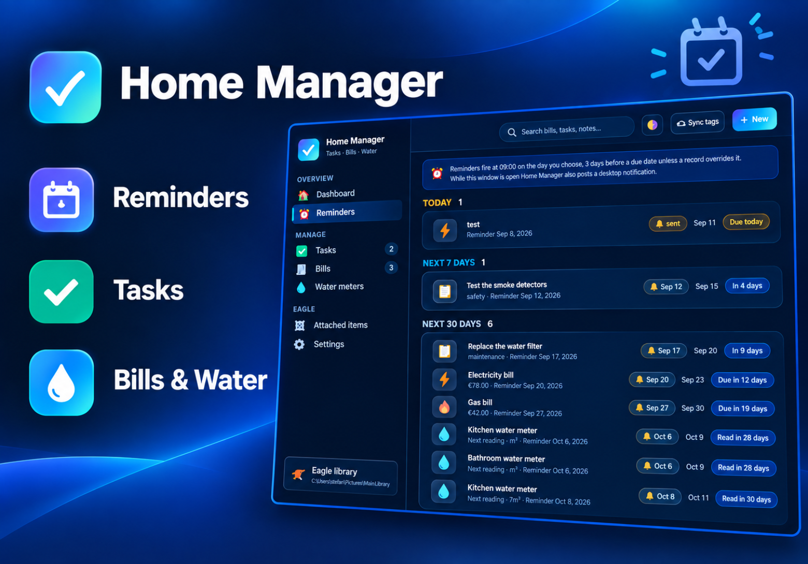
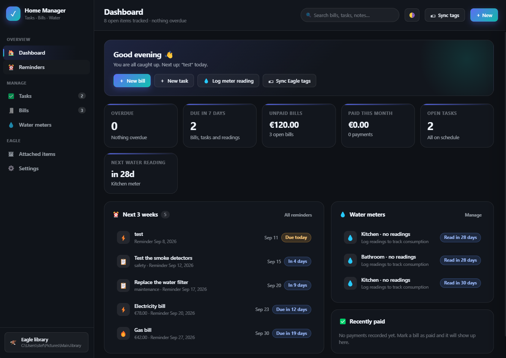
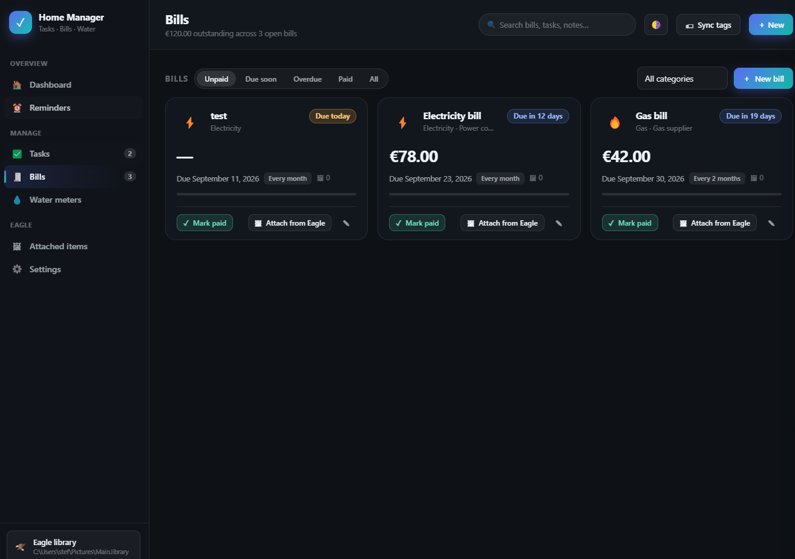
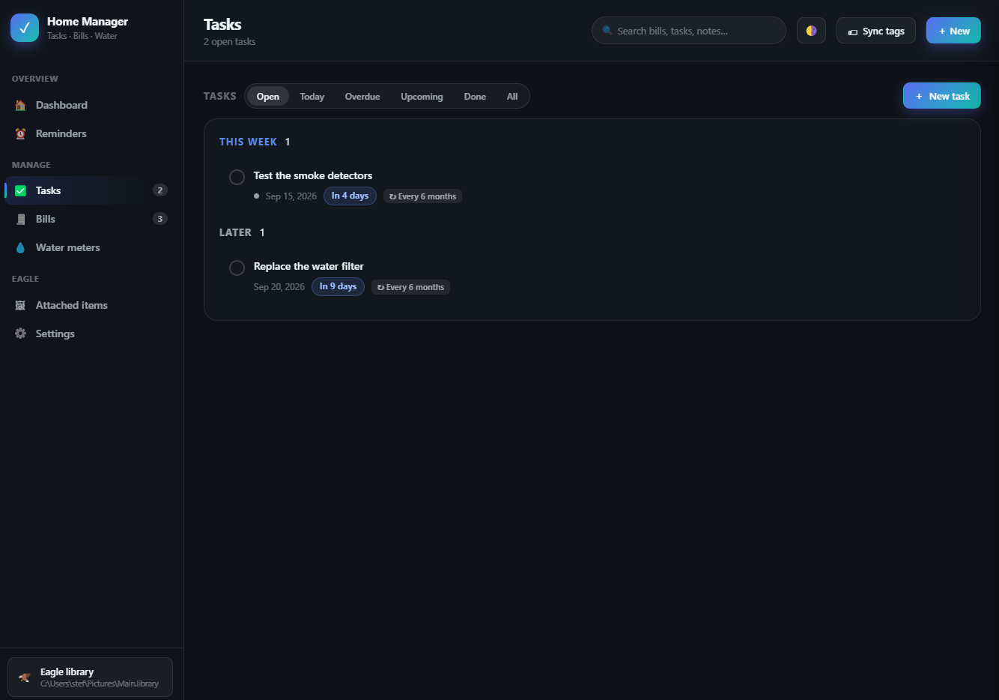
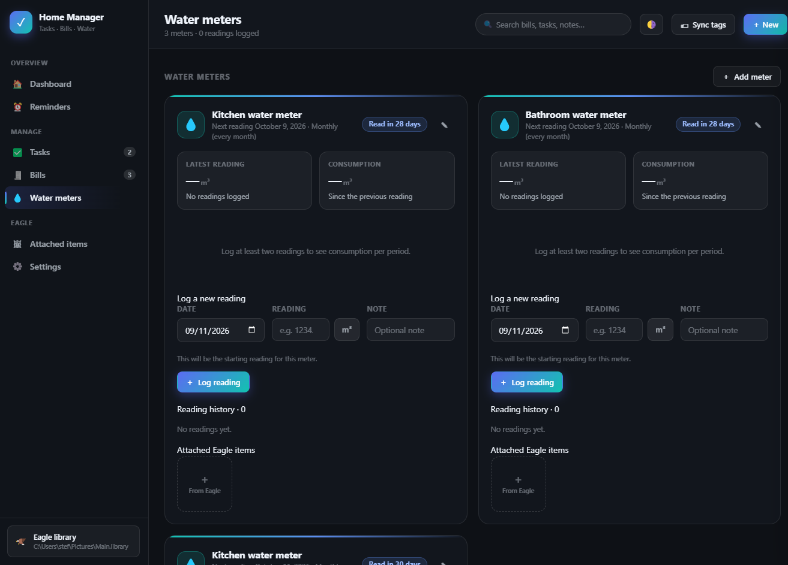
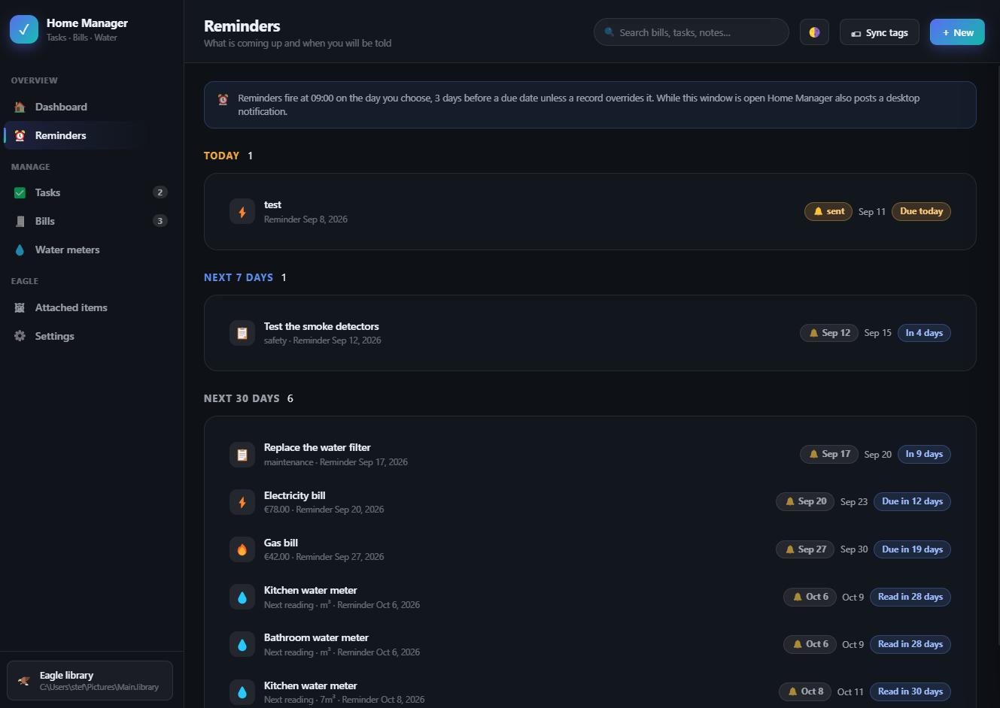
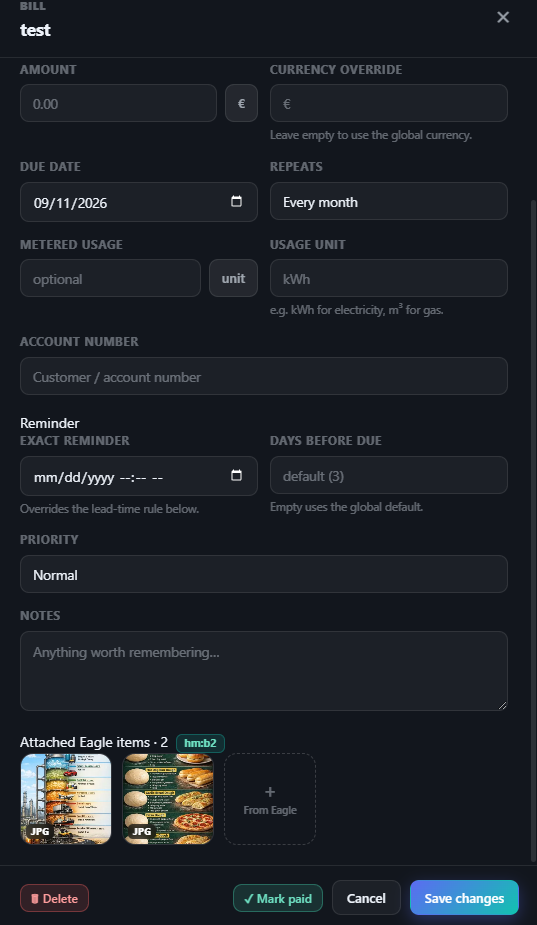
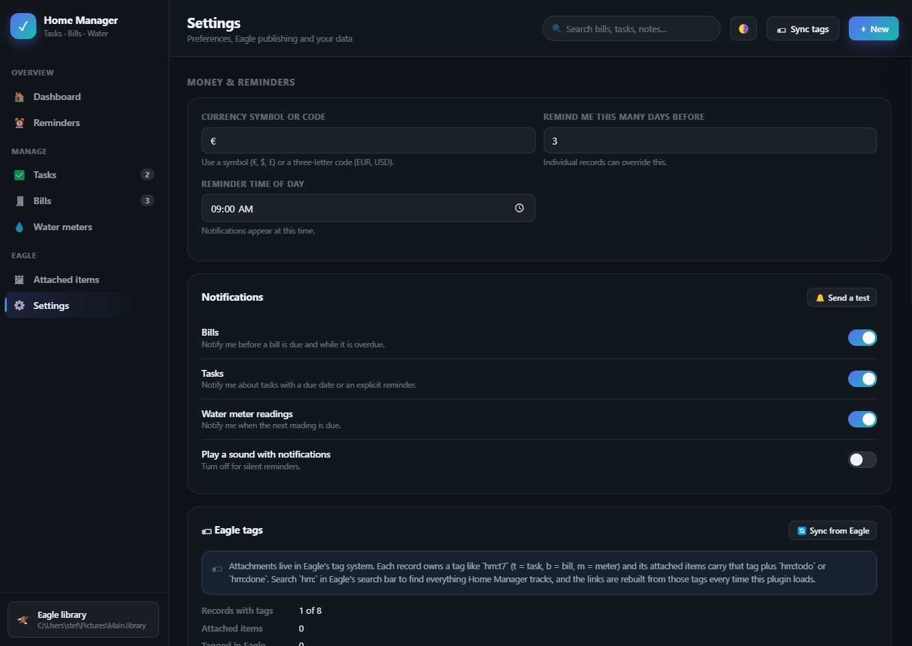
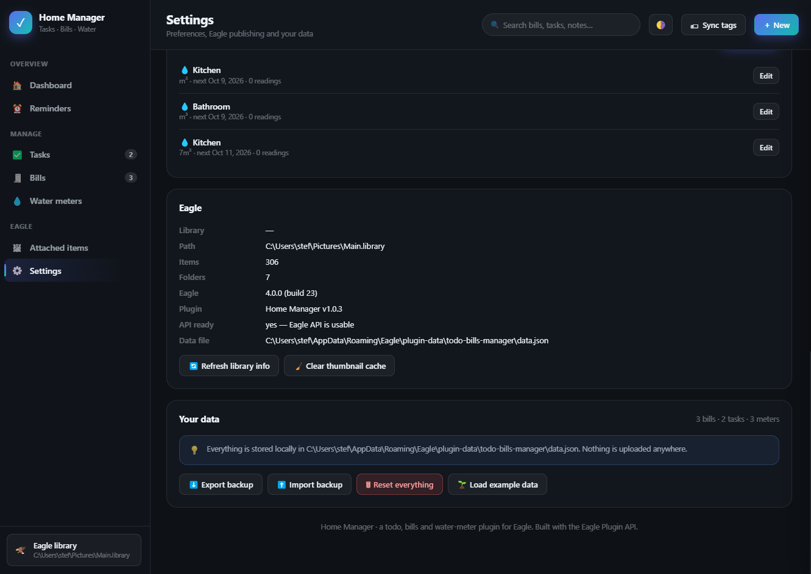

# Home Manager — an Eagle plugin for tasks, bills and water meters

A beautiful little household manager that lives inside [Eagle](https://eagle.cool):
recurring bills (electricity, gas, water…), custom tasks and reminders, and
kitchen/bathroom water-meter consumption tracking — where **your own Eagle items
are attached to tasks and bills and tagged permanently**, so the link survives
restarts, re-indexes and even a wiped data file.



---

## Why it fits Eagle

Two things make this an Eagle plugin rather than a generic to-do app:

1. **Attachments live in Eagle's tag system.** Attach one or many real items from
   your library — a photo of the meter, a scanned invoice, a receipt — to a task,
   a bill, a meter or an individual meter reading. Home Manager then writes an
   identity tag (`hm:t7`) plus a state tag (`hm:todo` / `hm:done`) onto each
   attached item, **on the item itself**. Those tags are the durable record:
   every time the plugin loads it reads them back and rebuilds its attachments,
   so a lost or wiped `data.json` costs you nothing. Search `hm:` in Eagle to see
   everything Home Manager tracks, right inside Eagle.
2. **The state travels with the item.** Complete a task or pay a bill and the
   attached items are retagged `hm:done`; reopen it and they go back to
   `hm:todo`. Eagle itself always shows you which of your items belong to an open
   record and which belong to a finished one.

Nothing is rendered, generated or duplicated — Home Manager only ever *links to*
and *tags* items that already exist in your library.

Everything is stored locally. Nothing is uploaded anywhere.

---

## Screenshots

<table>
<tr>
<td width="50%">
<b>Dashboard</b><br>
Everything that needs attention: overdue and due-soon counts, the outstanding total, what was paid this month, open tasks, the next water reading, a three-week timeline and recent payments.
<br><br>
</td>
<td width="50%">
<b>Bills</b><br>
Recurring and one-off bills with amount, a due-date progress bar, the repeat rule and the attached-item count. Mark paid, attach items, or open the full editor.
<br><br>
</td>
</tr>
<tr>
<td width="50%">
<b>Tasks</b><br>
Grouped into Overdue / Today / This week / Later / No date / Completed, with due pills, repeat rules, checklist progress and attached items shown right on the row.
<br><br>
</td>
<td width="50%">
<b>Water meters</b><br>
One panel per meter: the latest reading, consumption since the previous reading, the average per day, a chart per period and the full reading history.
<br><br>
</td>
</tr>
<tr>
<td width="50%">
<b>Reminders</b><br>
Every open bill, task and meter, grouped by urgency, showing when each reminder fires and whether it has already been sent.
<br><br>
</td>
<td width="50%">
<b>Attach your own Eagle items</b><br>
Pick items from the library — or attach whatever is selected in Eagle. The record shows the tag it owns (<code>hm:b2</code> here), and detaching removes that tag from the item again.
<br><br>
</td>
</tr>
<tr>
<td width="50%">
<b>Settings — money, reminders and notifications</b><br>
Currency, reminder lead time and time of day, per-record-type notifications with a test button, and the Eagle tag panel with live counts.
<br><br>
</td>
<td width="50%">
<b>Settings — library, diagnostics and your data</b><br>
Library path, item and folder counts, Eagle version, plugin version, whether the Eagle API is usable and where the data file lives — plus backup, import, reset and example data.
<br><br>
</td>
</tr>
</table>

---

## Install

The plugin files live at the **root of this project, next to this README**:
`manifest.json`, `logo.png`, `index.html`, `css/`, `js/`. Everything else
(`tools/`, `dist/`) is development tooling and is never installed.

Eagle loads plugins from `%APPDATA%\Eagle\plugins\<plugin-id>\`, and it uses the
manifest `id` as that folder name.

> **The plugin id must be a UUID.** Eagle rejects packages whose id is not:
> *"Your plugin ID format is incorrect. Please ensure that the plugin ID is in a
> valid UUID format."* This plugin's id is
> `4b26f1dd-6746-4837-abb8-19f64b6530ad`. Every store-installed plugin on a normal
> machine has a UUID id — only Eagle's own bundled plugins (like `video2gif` or
> `ai-sdk`) use short ids, because they ship with the app.
> `tools\package.ps1` now **fails the build** if the id is not a UUID.

### Option A — build and install in one step (recommended)

```powershell
powershell -File tools\package.ps1 -Install
```

That packages `dist/Home-Manager-<version>.eagleplugin`, wipes and recreates
`%APPDATA%\Eagle\plugins\4b26f1dd-6746-4837-abb8-19f64b6530ad`, copies the plugin
files in, and then verifies the installed copy is byte-identical to the source. It
refuses to package anything that contains `tools/`, `dist/` or `README.md`.

Then press `P` in Eagle (or use the plugin button in the toolbar) and pick
**Home Manager**. `runAfterInstall` is on, so it also opens by itself the first
time Eagle sees it. If it does not appear, restart Eagle.

### Option B — copy the files by hand

```powershell
$dest = "$env:APPDATA\Eagle\plugins\4b26f1dd-6746-4837-abb8-19f64b6530ad"
New-Item -ItemType Directory -Force $dest | Out-Null
Copy-Item manifest.json, logo.png, index.html, css, js -Destination $dest -Recurse -Force
```

### Option C — install the packaged plugin

`dist/Home-Manager-1.0.0.eagleplugin` is a normal ZIP archive with the plugin
files at its root — the same format Eagle's own *Pack Plugin* produces. Drop it
on Eagle, or double-click it, to install.

### Option D — let Eagle pack it

Right-click the plugin in Eagle's plugin panel → **Pack Plugin**. That produces
a `.eagleplugin` you can publish or share.

---

## What's in it

### Dashboard
Overdue count, due-in-7-days, outstanding bill total, paid-this-month,
open tasks, and the next water reading. Plus a three-week timeline and a water
snapshot. Everything is clickable.

### Bills
Recurring and one-off bills with amount, currency, provider, account number,
metered usage, category and repeat rule.

- **Mark paid** records the amount, the date and which due date it settled, into
  a per-bill payment history.
- **Rolling due dates:** when a repeating bill is paid, the due date advances to
  the next period automatically. If you paid several periods late, it skips
  forward until the date is in the future rather than stopping one period after
  a stale date.
- Filters for unpaid / due soon / overdue / paid, plus category filtering.
- Payment history is kept and shown per bill.

### Tasks
Custom tasks with due dates, priority, category, recurrence and an optional
checklist.

- Recurring chores (for example "test the smoke detectors" every 6 months) stay
  open and jump to the next occurrence instead of disappearing when completed.
- Completing a task logs the completion date.

### Water meters — Kitchen & Bathroom
One card per meter, each with its own reading history.

- Log readings with a date and a note; **consumption is calculated for you** as
  the difference from the previous reading.
- A meter reset (reading lower than the previous one) is reported as
  "no consumption" instead of a nonsense negative number.
- Consumption is charted per reading, with an average per day between the two
  most recent readings.
- Each meter has its own reading cycle (monthly, every 2/3/6 months, yearly or a
  custom number of days) and drives the next-reading due date + reminder.
- Readings can be edited or deleted; consumption recalculates around them.
- Readings can carry their own Eagle attachments — handy for a photo of the
  dial.

### Reminders
Every bill, task and meter gets a reminder time:

- an explicit date/time (`Exact reminder`), or
- a lead time — *N* days before the due date at a configurable time of day
  (global default, overridable per record).

When a reminder falls due, Eagle shows a desktop notification and an in-app
toast. Overdue items re-notify once per day so a missed bill does not go quiet.

> **Note on timing:** this is a window plugin, so reminders are evaluated while
> the plugin window is open, and it catches up on anything it missed as soon as
> it opens. If you want notifications with the window closed, set
> `"serviceMode": true` inside `main` in `manifest.json` — see *Making it a
> background service* below.

### Attached items
A single gallery of every Eagle image linked to any record, with the owner
labelled on each tile.

### Settings
Currency, reminder defaults, per-type notification switches, a test
notification, the Eagle tag panel (live counts of tagged attachments, the tag
scheme, and a **Sync from Eagle** button), library info, and data management:
export a JSON backup, import one, reset, or load the example data.

---

## Using the Eagle integration

### Attach items from your library
Open any task, bill or meter → **Attached Eagle items** → **+ From Eagle**
(or the **🖼 Attach from Eagle** button on a task row / bill card).

- Browse by folder (the folder tree of your active library), or search.
- **Images only** vs **All file types** toggle.
- Multi-select, then **Attach selected**.
- **⬅ Use current Eagle selection** attaches whatever is selected in Eagle right
  now — the fastest route when you already have the photo on screen.

The moment you attach, Home Manager writes the tags onto those Eagle items. The
attachment strip, the task rows and the bill cards all show the thumbnails, so
you can see what is linked without opening anything.

### The tag scheme

| Tag | Meaning |
| --- | --- |
| `hm:t7` | Attached to **task** #7 |
| `hm:b3` | Attached to **bill** #3 |
| `hm:m1` | Attached to **water meter** #1 |
| `hm:todo` | That record is still open (task not done / bill unpaid) |
| `hm:done` | That record is finished (task done / bill paid) |

The single letter tells you what kind of record it is, the number is a stable
per-record code. Water meters carry no state tag because they have no "done".

**Attaching one item therefore writes exactly two tags** — the identity tag that
forms the link, and the state tag. Both are needed: the identity tag is what lets
Home Manager find the item again on the next load, and the state tag is what tells
you in Eagle whether that record is still open. There is nothing to clean up by
hand.

What this buys you:

- **Permanence.** Every load, Home Manager re-reads the `hm:` tags from Eagle and
  adopts any item it finds. Delete `data.json` and your attachments come back.
- **Discoverability in Eagle.** Search `hm:` (or `hm:t7`) in Eagle's own search
  bar to see every item attached to a record, without opening the plugin.
- **State that tracks reality.** Complete a task → its items flip to `hm:done`.
  Reopen it → back to `hm:todo`.
- **Manual linking.** Tag an item `hm:t7` and `hm:todo` yourself in Eagle, hit
  **Sync tags**, and it is attached. Home Manager never removes a link just
  because you removed a tag — detaching is explicit.

### Detaching

Detaching (the `✕` on a thumbnail) removes the Home Manager tags from the Eagle
item and drops the link; the item itself is never modified beyond its tags.

Which identity tag to remove is resolved in order of reliability: the tag recorded
on the attachment when it was written, then the record's own code, then whatever
`hm:<kind><n>` tag the item is actually carrying. The last fallback exists because
relying on the record's code alone once left a stranded tag behind — see
*Troubleshooting*.

The todo/done state tag is only removed when no other record still points at the
item, since one item can legitimately be attached to several records. Detach a
shared item and the remaining owner keeps its state tag, which the next sync
refreshes.

### Syncing

- The top bar has **🏷 Sync tags**, and Settings has **🔄 Sync from Eagle**.
- With *Re-sync tags every time the plugin opens* enabled (the default), the
  library is re-read on every load, and again whenever you switch libraries in
  Eagle.
- Attachments remember which **library** they came from. An item from another
  library cannot be read or tagged until that library is active in Eagle; it
  shows as 🔒 and is flagged `!` in the attachment strip, and it gets tagged the
  next time you open that library and sync.

> Eagle exposes only the *current* library to plugins, so the picker browses the
> library that is active in Eagle right now. Switch libraries and the plugin
> follows (you get a "Library changed" notice and an automatic re-sync).

---

## Keyboard shortcuts

| Key | Action |
| --- | --- |
| `/` | Focus search |
| `b` | New bill |
| `t` / `n` | New task |
| `w` / `m` | New water meter |
| `d` | Dashboard |
| `r` | Reminders |
| `Esc` | Close dialog / drawer, or clear search |

---

## Where your data lives

```
%APPDATA%\Eagle\plugin-data\todo-bills-manager\data.json
%APPDATA%\Eagle\plugin-data\todo-bills-manager\diagnostics.log
```

The folder keeps the readable name `todo-bills-manager` rather than the plugin's
UUID, so it is obvious what it belongs to and so data written before the id
changed is still found.

Written atomically (temp file + rename) and debounced while typing. The data path
comes from Eagle, which refuses API access until the plugin is created — so if the
path is not available yet the plugin starts on `localStorage` and **migrates to
the file as soon as Eagle is ready**. Memory is the last resort. The active
backend and path are shown in **Settings → Eagle**.

**This file is a cache, not the source of truth for attachments.** The links
between your records and your Eagle items live as `hm:` tags on the Eagle items
themselves, so losing this file costs you the record titles, amounts and due
dates — not the attachments, which are re-read from the library on the next
load.

Use **Settings → Your data → Export backup** for a portable JSON copy.

---

## Troubleshooting

### "This method can only be used after the `plugin-create` event is triggered"

**This is Eagle's own message, not the plugin's, and since v1.0.3 it is no longer
reported as a failure.**

Where it comes from — Eagle's preload defines its renderer-to-renderer channel
like this (from `app.asar`):

```js
ipcRenderer.r2r = async (id, channel, data) => {
    return new Promise((resolve, reject) => {
        if (id === undefined || id === null) {
            reject('This method can only be used after the `plugin-create` event is triggered. …');
            return;
        }
        …
```

`id` is the plugin window's id, which Eagle only assigns once the plugin is
created. Two consequences:

- Every Eagle API call made before that rejects, and because it is a **`reject()`
  with a plain string** the rejection carries **no stack trace**.
- Such rejections can originate from Eagle's *own* internals, not from this
  plugin. They surface in the plugin window as unhandled rejections, which is how
  they became visible at all.

What the plugin does about it, so this cannot become a user-facing error:

- The create handler is registered at **script-evaluation time**, because Eagle
  only honours handlers registered while the page is loading.
- Readiness is established by **whichever comes first**: the create event, or a
  probe that proves an Eagle API call actually succeeds.
- Every Eagle call sits behind that readiness check, and every probe of the
  `eagle` object is wrapped.
- An unhandled rejection carrying this string **while the API is not yet usable**
  is recorded in `diagnostics.log` and logged, and deliberately **not** shown as
  a failure. It is still shown if it ever appears *after* the API is usable,
  because then it would be a real problem.

If you do see the toast, check **which build is live**:

- The toast title carries the version: `Something went wrong (v1.0.3)`. Anything
  at or below `v1.0.2` predates this classification. `(vdev)` meant the manifest
  never arrived, which `v1.0.3` no longer depends on.
- **Settings → Eagle → API ready** should read *"yes — Eagle API is usable"*.
- `plugin-data\todo-bills-manager\diagnostics.log` records a `startup` line with
  the readiness state, a `readiness` line for how the plugin came alive, and a
  `host-not-ready` line for each of these host rejections.

### Reading `diagnostics.log`

Eagle does not reliably forward a plugin's console output into
`%APPDATA%\Eagle\log.log`, and its rejections carry no stack, so the plugin keeps
its own small, bounded log next to the data file:

```
%APPDATA%\Eagle\plugin-data\todo-bills-manager\diagnostics.log
```

It holds a `startup` line per launch (version, readiness, backend, data path),
how readiness was reached, and the full detail of any failure. It is capped at
about 200 KB and starts over past that.

### "I have two Home Manager entries", or updates do not take effect

Eagle keeps its plugin list in its own local storage and can register the **same
plugin from more than one folder** — for example one entry for
`%APPDATA%\Eagle\Plugins\4b26f1dd-6746-4837-abb8-19f64b6530ad` (installed) and one
for a source folder you added through *Developer Options*. When that happens, which
code runs depends on which entry you click, and an entry pointing at a folder that
has since moved or been emptied will simply fail.

This matters more than usual after the id change: builds up to v1.0.3 used the id
`todo-bills-manager`, so Eagle may still list that as a **separate** plugin. Remove
it.

To clean it up:

1. Open Eagle's plugin panel (press `P`).
2. Remove every **Home Manager** entry — right-click → remove/uninstall.
3. Install exactly one copy, either with `tools\package.ps1 -Install` or by
   opening the `.eagleplugin` from `dist/`.
4. Restart Eagle, then confirm via *Settings → Eagle → API ready* or the
   `started v…` line in `log.log`.

If you develop from the source folder instead, keep that as your single entry and
skip the install — but do not keep both.

### Detaching leaves an `hm:…` tag behind

Fixed in **v1.0.2**. Attaching a tag while creating a *new* record allocated the
tag code on the editor's unsaved draft, and that code was not carried over when
you clicked **Create**. The record ended up with no code, so on detach it could
not tell which identity tag was its own and only the `hm:todo` / `hm:done` state
tag was removed — leaving a stranded tag such as `hm:b1`.

Existing stranded tags heal themselves: on the next load (or a **Sync tags**),
Home Manager reads the tags back off the attached items and adopts the matching
code, after which detaching removes everything. If you would rather clean up by
hand, simply delete the leftover `hm:…` tag in Eagle.

The regression test for this is `#bills:newattach`, which creates a record, attaches
an item *before* saving, saves, and then asserts that detaching removes every
`hm:` tag — and that a record which has already lost its code recovers it.

### A click seems to do nothing

Every uncaught error and rejected promise now raises a toast naming the message,
the origin and the plugin version, and is written to Eagle's log with its full
text. If a button appears dead and no toast appears, the click never reached a
handler — please report which button.

---

## Making it a background service

To keep reminders running even with the plugin window closed, add
`"serviceMode": true` to the `main` block of `manifest.json`:

```json
"main": {
    "serviceMode": true,
    "url": "index.html",
    ...
}
```

Eagle then starts the plugin with the application instead of on click. Note that
Eagle treats service plugins as resident background processes, so verify the
window still behaves the way you want before relying on it.

---

## Project layout

The plugin files sit at the **root** of this project, next to this README - they
are exactly the items listed in `$PluginFiles` in `tools/package.ps1` (mirrored in
`tools/make-preview.js`), and nothing else is ever installed or packaged:

```
manifest.json               id, window config, keywords
logo.png                    512x512 plugin icon
index.html                  window shell
css/style.css               design system (dark-first, light variant, Eagle theme aware)
js/util.js                  ids, local-date math, money/number formatting, DOM helpers
js/store.js                 data model, persistence, recurrence, statuses, alerts
js/bridge.js                everything that talks to Eagle (items, folders, thumbnails, tags, dialogs)
js/tags.js                  the tag scheme: stable codes, todo/done tags, reconciliation on load
js/ui.js                    toasts, modals, drawer, Eagle item picker, attachment strip
js/views.js                 the seven screens and their editors
js/app.js                   bootstrap, routing, chrome, reminder engine

README.md                   this file
LICENSE                     MIT
assets/                     screenshots used by this README (not packaged)
dist/                       packaged .eagleplugin builds

tools/                      development tooling (never installed, never packaged)
  package.ps1               builds the .eagleplugin and optionally installs it
  test-store.js             headless data-layer test suite (89 assertions)
  make-logo.ps1             regenerates logo.png
  make-preview.js           builds tools/preview/app from the plugin files with a mocked Eagle API
  render-previews.ps1       renders every screen headless and builds a contact sheet
  verify-screens.ps1        per-screen runtime-error report, in text
  make-montage.ps1          contact-sheet builder
  preview/mock-eagle.js     mock Eagle API used by the preview harness
```

## Development

**Package / install**

```powershell
powershell -File tools\package.ps1             # package only
powershell -File tools\package.ps1 -Install    # package and install into Eagle
```

**Tests** - the data layer runs headless with a mocked Eagle environment and a
real temp directory for the data file:

```powershell
node tools\test-store.js
```

It covers local-date arithmetic (month clamping, DST, leap years), seeding,
bill/overdue status, payment rolling, task recurrence, meter consumption
including out-of-order entry and meter resets, reminder timing, notification
de-duplication, alerts/summary, attachments, backup round-trip and reload from
disk.

**Visual check** - renders the real UI in headless Chrome against a mock Eagle
library and builds a contact sheet of every screen in `tools/preview/shots/`.
A red bar across the top of a tile means that screen threw at runtime; a green
bar means it was clean.

```powershell
powershell -File tools\render-previews.ps1     # images + contact sheet
powershell -File tools\verify-screens.ps1      # text pass/fail per screen
```

`verify-screens.ps1` also drives two end-to-end flows through the real UI:

- **`#bills:attachflow`** — opens an editor, types into a field, attaches an Eagle
  item through the real picker, and asserts that the attachment reached the
  stored record *and* that the typed value survived the refresh.
- **`#tasks:tagflow`** — the whole tag lifecycle: attach an item and assert the
  item carries `hm:tN` + `hm:todo`; complete the task and assert it flips to
  `hm:done`; then **wipe the local attachment link** and assert it is recovered
  from the Eagle tag alone; then detach and assert the tags are stripped.
- **`#dashboard:latecreate` / `#tasks:latecreate`** — a strict host mode where the
  mock refuses every Eagle API call (throwing Eagle's exact error) and fires
  `plugin-create` 2.2s late. This guards the rule that nothing may touch the
  Eagle API before that event.
- **`#dashboard:missedcreate` / `#tasks:missedcreate`** — a stricter mode where
  the host **never** delivers `plugin-create` at all, modelling a handler
  registered too late. The plugin must still detect readiness by probing and
  write its tags. Remove the probing and this test fails with *"the plugin never
  became usable even though the Eagle API was callable"*.

The mock Eagle API implements `save()` against a real in-memory item list and
filters `item.get({ tags })` the way Eagle does, so those assertions test actual
tag round-tripping rather than a stub.

Note: headless Chrome needs named-pipe IPC, so these must run outside a
restricted file sandbox.

---

## License

MIT — do whatever you like with it.
